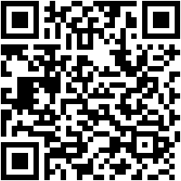

  

<h1 align="center" style="font-size: 36px;">Newsmosphere 🌍</h1>

Catch the News, Before the News Catches You! 📰🚀 
Welcome to Newsmosphere - Your Ultimate News Companion. Filter. Browse. Read. Repeat. Because staying informed has never been this fun! 🎉

  

  
   
  <em>Scan the QR code and dive into a world where the news is fresh and the app is fresher! 📱✨</em>

## 📋 Table of Contents

- [🌟 What is Newsmosphere?](#what-is-newsmosphere)
- [🚀 Features That Keep You Ahead](#features-that-keep-you-ahead)
- [🔧 The Magic Under the Hood](#the-magic-under-the-hood)
- [🛠️ Getting Started](#getting-started)
- [👨‍💻 Meet the Creator](#meet-the-creator)
- [🤝 Contribute & Collaborate](#contribute--collaborate)
- [📜 License Info](#license-info)

  

# 🌟 What is Newsmosphere?

Welcome to **Newsmosphere**! 🎉 Where news is more than just information—it's an experience. Imagine a place where the headlines come alive, the details are just a tap away, and the categories fit your preferences like a custom-tailored suit 👔. Whether you're a news junkie 📰, a casual browser 👀, or just avoiding small talk by knowing a bit of everything 🧠, Newsmosphere has got you covered.

# 🚀 Features That Keep You Ahead

- **Breaking News Bonanza**: Get your hands on the latest news before it even thinks about going viral. 📈
- **Custom Category Chaos**: Filter your news like a pro! Want sports? 🏀 Politics? 🗳️ Cat videos? 🐱 (Okay, maybe not cat videos, but close enough.) It’s all here.
- **Headlines That Make You Look Smart**: Impress your friends (and maybe your boss) by staying on top of the most important stories. Instant water cooler cred! 💬
- **Deep Dive Articles**: Go beyond the headlines with in-depth stories that give you the full scoop. 🍨 Because sometimes, you just need to know everything.
- **Personalized Newsfeed**: Tailor your news to your taste. You like it spicy? 🌶️ We’ve got the hot takes. Prefer it mild? 🧊 We can keep it chill. Your news, your rules. 🎯

# 🔧 The Magic Under the Hood

- **React Native (CLI)**: Built with the power of React Native CLI for a native app experience that’s smoother than your morning coffee ☕.
- **News Data API**: Powered by real-time news data to keep you updated 24/7. No fluff, just the good stuff. 💎
- **Expo (Just Kidding!)**: Nah, we’re old school with React Native CLI here. Who needs shortcuts when you’ve got skill? 🛠️
- **JavaScript Wizards**: Handling the logic, magic 🧙, and everything in between to bring you the news, minus the boring stuff.

# 🛠️ Getting Started

1. **Download the App**: Wait, you haven’t downloaded Newsmosphere yet? 🤔 What are you waiting for? Get it now and join the cool kids. 😎
2. **Customize Your Feed**: Start by picking your favorite news categories. Or let us surprise you—who doesn’t love a good plot twist? 🎭
3. **Stay Informed, Stay Awesome**: Scroll, tap, read, repeat. Your new daily routine just got a major upgrade. 🔄

# 👨‍💻 Meet the Creator

**Newsmosphere** was lovingly crafted by Konain Raza, a developer with a keen eye for news 👁️ and a knack for making apps that don’t just work, but wow. 💥 When Konain’s not buried in code, you’ll find him hunting down the next big headline—or maybe just enjoying a cup of chai ☕.

# 🤝 Contribute & Collaborate

Got ideas? 💡 Bugs to squash? 🐛 Or just want to make Newsmosphere even better? 🌟 We’re all ears 👂 (and code). Fork the repo, submit a pull request, and let’s make the news world a better place, one commit at a time. 🔧

# 📜 License Info

Newsmosphere is licensed under the MIT License, because we believe in sharing the love ❤️ (and the code). Check out the [LICENSE](LICENSE) file for the nitty-gritty legal stuff. 📝

---

Get ready to level up your news game with Newsmosphere! 🌍 Stay ahead, stay informed, and most importantly, stay curious. 📰🚀
